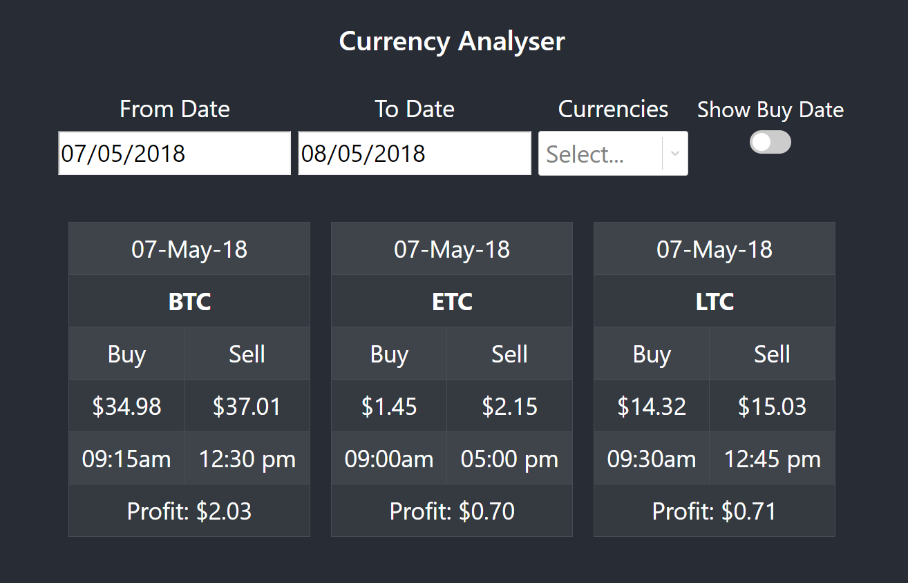

# Currency Annalyser
This project contains a full stack application for analysing currency based on historical data. The application reads the data from a <b>json</b> file and filters it based on the 'from date' and 'to date' interval as well as currencies selected by the user. The application then analyses the data to find the best possible buy price, buy time, sell price, sell time and the profit for each one of the selected currencies. 

The application uses the following technologies:
- Backend: NodeJs with an ExpressJs server
- Frontend: ReactJs 
- Type Checking: Typescript



## Getting Started

```bash
cd ./server
npm install
npm start
```

The server runs on port `5000`.

There are three routes:
```
- http://localhost:5000/                - homepage
- http://localhost:5000/api/currencies  - accepts GET requests for retrieving all the unique currencies
- http://localhost:5000/api/profits     - accepts POST requests with fromDate, toDate and a list of currencies as post data
                                          e.g. {fromDate: '20180507', fromDate: '20180507', currencySelected: ['BTC', 'ETC']}
```

## Scripts

### Server

```
- npm run eslint           - will run the linter checks
- npm test                 - will run all the tests
- npm run coverage         - will generate code coverage reports
- npm run build            - will generate generate .js from the .ts files for production use
- npm run build:watch      - will generate generate .js from the .ts files for production use and watch for changes
- npm run dev              - will run the dev server
- npm start            - will start the production server
```

### Client

```
- npm run build            - will run webpact to generate static content out of jsx
- npm test                 - will run all the tests
- npm run eject            - will give access to all config files
- npm start                - will start the dev server
```

## Project Structure

### Overall Structure

1. The project is devided in to two main directories. 
2. The `server` directory contains the express server as well as all the helper classes.
3. The `client` directory contains the reactjs Frontend code.

### Server Structure

1. The `server/test` directory contains all the unit and integration tests for the Backend server.
2. The `server/src` directory contains the route handler, the main app.ts and services.
3. The `server/data` directory contains the currency data in a json format.
4. The `server/config` directory contains all the site specific configs.
5. The `server/dist` directory contains all compiled js files.
6. The `server/public` directory contains all the static files generated by webpack build.

### Client Structure

1. The `client/src/App.tsx` directory contains the root react component for the Frontend.
2. The `server/src/dateForm.tsx` directory contains the functional component for generating the form.
3. The `server/src/profitTable.tsx` directory contains the functional component for creating the profit tables.

## Development

This project uses EditorConfig to standardize text editor configuration.
Visit http://editorconfig.org for details.

This project uses ESLint to detect suspicious code in JavaScript files.
Visit http://eslint.org for details.

### Testing

This project uses Mocha, Chai and supertest for testing.
Visit http://mochajs.org, http://chaijs.com and https://www.npmjs.com/package/supertest for details.

To execute tests:

```bash
npm test
```

Code coverage generated by http://istanbul.js.org

To calculate coverage:

```bash
npm run coverage
```

The coverage reports will be in the `coverage` folder

### Dev Server

To run the development express server and start `nodemon`:

```bash
cd server
npm run dev
```

To run the development react server:

```bash
cd client
npm start
```

## FAQ

## Credits

Written by Shahriar Hasan Khan
Contact: shahriar27@hotmail.com

